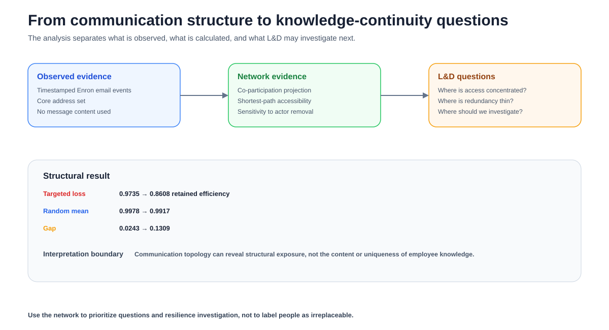

# Organizational Communication Resilience Under Key-Actor Loss

> **Empirical Research Bundle** · **Portfolio Track: Learning & Development Research** · Organizational Learning / Knowledge Resilience / Network Analysis

Empirical Enron communication-network resilience study comparing degree-targeted key-actor loss with cost-matched random removal.



## Study status

**Completed secondary empirical analysis.** Reported findings were calculated from the named public source on 25 September 2026. The rebuild script contains **no synthetic fallback**. Raw source data are not republished unless source terms permit it; `data/source_manifest.json` records provenance, retrieval details, licensing notes, and the claim boundary.

## Research question

> How resilient is potential organizational information access to the loss of highly connected employees compared with random employee loss?

## Design

- **Design:** Secondary observational network analysis of the Enron temporal email hypergraph
- **Source:** email-enron temporal hypergraph (XGI / Zenodo)
- **Source page:** https://zenodo.org/records/21909507
- **Direct data endpoint:** `https://zenodo.org/records/21909507/files/email-enron.json`
- **Retrieval / analysis date:** 2026-09-25
- **Licensing / reuse note:** Open Zenodo dataset record; cite the dataset and respect source-record reuse terms.

## Hypotheses

1. H1: removing high-degree actors reduces normalized global efficiency faster than removing the same number of randomly selected actors.
2. H2: the targeted-versus-random resilience gap widens as more key actors are removed.

## Empirical method

Project each email hyperedge into an undirected employee co-participation graph, compute baseline global efficiency, rank actors by projection degree, then compare degree-targeted removals with 200 seeded random removals at k = 5, 10, 15, 20, and 30. Report retained efficiency relative to the intact network.
**Metric note:** global efficiency is recomputed on the remaining nodes after each removal and then divided by the intact-network value. A retained-efficiency ratio slightly above 1 is therefore possible when a removal eliminates peripheral nodes and shortens average paths among the survivors; it does not mean the removed organization is universally “better.”


## Headline empirical finding

Targeted removal progressively lowers normalized global efficiency while cost-matched random removal leaves mean efficiency close to baseline. At 30 removals, targeted retained efficiency is 0.8608 versus 0.9912 under random removal.

### Headline metrics

- **nodes**: 148
- **hyperedges**: 10885
- **incidences**: 26914
- **projection edges**: 2583
- **baseline global efficiency**: 0.5601
- **targeted retained efficiency k30**: 0.8608
- **random retained efficiency k30**: 0.9912

The packaged derived tables are documented in `docs/data_dictionary.md`. That document states explicitly whether each CSV is a complete analysis table or a diagnostic subset.


## What this study can and cannot claim

**Can claim:** the computations in this repository summarize the named public dataset under the documented operationalization.

**Cannot claim:** Email connectivity is a proxy for potential information access, not a direct measure of tacit knowledge, expertise, performance, or causal knowledge transfer. The Enron setting also limits external validity.


## Reproduce

Offline verification of packaged empirical results:

```bash
python -m pip install -r requirements.txt
pytest -q
python run_demo.py
```

Recompute the empirical analysis from the public source (internet required):

```bash
python scripts/fetch_and_analyze.py
```

The online rebuild calls study-specific functions from `research/model.py`; the tests exercise those functions and scientific invariants rather than only checking file presence.

## Research bundle contents

- `README.md` — study overview and bounded findings
- `EMPIRICAL_STUDY.md` — protocol, validity, and interpretation
- `data/source_manifest.json` — provenance, license note, and claim boundary
- `data/derived/` — compact derived empirical tables
- `results/empirical_summary.json` — machine-readable headline results
- `scripts/fetch_and_analyze.py` — public-source rebuild
- `research/model.py` — reusable study-specific analysis functions
- `tests/` — behavioral and scientific-invariant tests
- `docs/` — analysis plan, data dictionary, paper blueprint, references, originality map
- `assets/` — four study-specific SVG figures

## Research integrity

This bundle distinguishes **source data**, **operationalization**, **result**, and **interpretation**. The analysis plan documents the released analysis; it is **not described as preregistered**. Public data do not automatically validate a construct, so proxy and external-validity limits are explicit.


> **Interpretation note.** Because global efficiency is recomputed over surviving-node pairs, the normalized surviving-network efficiency ratio can exceed 1.0 after some random removals. It is an efficiency ratio, not a bounded survival fraction.
