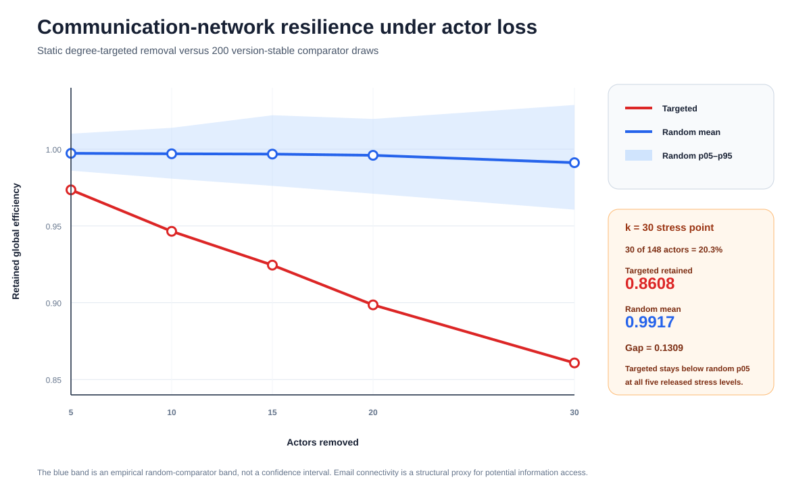
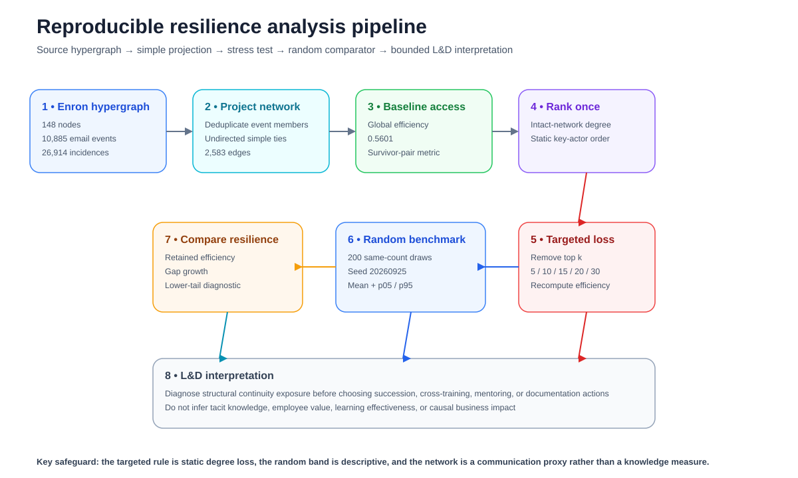
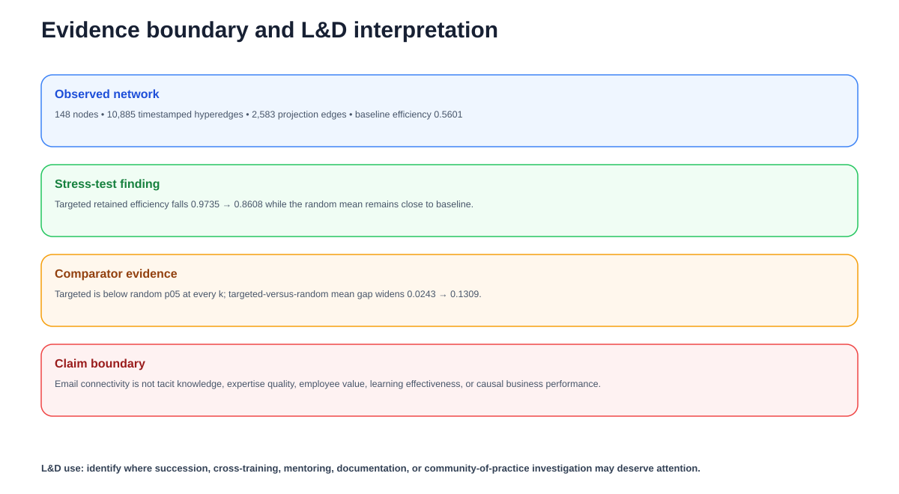

# Organizational Communication Resilience Under Key-Actor Loss

[](https://github.com/devissaputra/organizational_network_resilience/actions/workflows/ci.yml)
[](https://github.com/devissaputra/organizational_network_resilience/actions/workflows/empirical-rebuild.yml)

> **Learning & Development Research Package** · Organizational Learning · Knowledge Continuity · Organizational Network Analysis

A reproducible stress test of how much structural communication accessibility is lost when highly connected actors are removed from the Enron email network compared with same-count random actor loss.



## Start here

- [Scientific report](REPORT.md)
- [Empirical study protocol](EMPIRICAL_STUDY.md)
- [Paper blueprint](docs/paper_blueprint.md)
- [Analysis plan](docs/analysis_plan.md)
- [Research design](docs/research_design.md)
- [Reproducibility guide](REPRODUCIBILITY.md)
- [Data provenance](data/README.md)
- [Final QA evidence](QA_REPORT.md)

## Research question

> How resilient is potential organizational information access to the loss of highly connected communication actors compared with random actor loss?

## Source

| Item | Released value |
|---|---|
| Dataset | email-enron temporal hypergraph |
| Curator | XGI data collection |
| Zenodo DOI | 10.5281/zenodo.21909507 |
| Version | v0.1 |
| Nodes | 148 |
| Timestamped hyperedges | 10,885 |
| Source file | `email-enron.json` |
| MD5 | `3666af1fc5a190d93f7fd98cff58e283` |

The source represents email addresses and timestamped email events among a core Enron employee set.

Email communication is used here as evidence of **potential structural information access**. It is not treated as direct measurement of knowledge, expertise, trust, or performance.

## Empirical design

The study:

1. projects each email hyperedge into an undirected simple co-participation graph;
2. computes baseline global efficiency;
3. ranks actors once by degree in the intact graph;
4. removes the top 5, 10, 15, 20, and 30 actors;
5. compares each targeted result with 200 version-stable same-count comparator draws;
6. reports retained efficiency and the random 5th to 95th percentile diagnostic band.



## Network baseline

- nodes: **148**
- hyperedges: **10,885**
- incidences: **26,914**
- projection edges: **2,583**
- baseline global efficiency: **0.5601**

## Main result

| Actors removed | Removed share | Targeted retained efficiency | Random mean | Random p05 | Random p95 | Gap |
|---:|---:|---:|---:|---:|---:|---:|
| 5 | 3.4% | 0.9735 | 0.9978 | 0.9870 | 1.0115 | 0.0243 |
| 10 | 6.8% | 0.9465 | 0.9970 | 0.9807 | 1.0168 | 0.0506 |
| 15 | 10.1% | 0.9245 | 0.9971 | 0.9746 | 1.0226 | 0.0726 |
| 20 | 13.5% | 0.8986 | 0.9954 | 0.9716 | 1.0231 | 0.0968 |
| 30 | 20.3% | 0.8608 | 0.9917 | 0.9572 | 1.0304 | 0.1309 |

Targeted retained efficiency decreases at every tested level:

```text
0.9735 → 0.9465 → 0.9245 → 0.8986 → 0.8608
```

Meanwhile, the random mean remains close to baseline.

At **k = 30**, targeted actor loss leaves **0.8608** retained efficiency compared with **0.9917** under the random mean.

## Why the comparison is stronger than one curve

At every tested removal level, the targeted retained-efficiency result lies **below the random 5th-percentile order-statistic bound**.

### Comparator reproducibility correction

Strict source-to-release QA exposed that Python's built-in `random.sample` did not provide a sufficiently stable release contract for the exact comparator draws across runtimes. Version 1.1 therefore uses a deterministic SHA-256 ranking over the release seed, removal level, draw index, and node ID to construct the 200 pseudo-random same-count comparison sets. This preserves a reproducible comparator while preventing runtime-dependent drift in the published random means and percentile diagnostics.

That means the targeted curve is not merely a little lower than the random average in the released simulations. It sits below the lower tail of the 200-draw random comparator at every stress level.

This remains descriptive evidence, not a formal causal or significance result.

## L&D and knowledge continuity interpretation

The practical value is diagnostic.

A communication network that is structurally dependent on a small set of central actors can motivate closer examination of:

- succession coverage;
- cross-training;
- mentoring redundancy;
- documentation;
- communities of practice;
- access to expertise during onboarding;
- boundary-spanning roles;
- communication overload.

The analysis does **not** identify who possesses irreplaceable knowledge.

It identifies where communication structure is unusually sensitive to actor loss under the released stress test.

## Metric caution

Retained efficiency is:

```text
efficiency after removal / intact-network efficiency
```

It is recomputed among surviving nodes.

The ratio can be slightly above 1 when removing peripheral nodes shortens average paths among survivors. It is therefore not a bounded survival fraction or performance percentage.

## What this study contributes

The contribution is not a new network metric.

It is a reproducible L&D-facing framework that combines:

- a real organizational communication dataset;
- explicit source provenance;
- a transparent projection rule;
- static key-actor stress testing;
- a version-stable deterministic pseudo-random comparator generated by SHA-256 ranking;
- a complete five-level resilience curve;
- lower-tail diagnostics;
- bounded knowledge-continuity interpretation.

## Claim boundary

**Supported:** the released Enron communication projection is structurally more vulnerable to static degree-targeted removal than to same-count random removal under global efficiency.

**Not supported:** direct knowledge measurement, causal knowledge loss, individual employee value, organizational performance loss, optimal succession choices, or generalization to every workplace.



## Reproduce

Offline:

```bash
python -m pip install -r requirements.txt
pytest -q
python run_demo.py
python scripts/generate_figures.py
```

Source verification:

```bash
python scripts/fetch_and_analyze.py --check
```

Regenerate release evidence:

```bash
python scripts/fetch_and_analyze.py --write
python scripts/generate_figures.py
```

## Repository map

- `REPORT.md`: scientific report
- `EMPIRICAL_STUDY.md`: protocol and interpretation boundary
- `docs/paper_blueprint.md`: manuscript structure
- `docs/analysis_plan.md`: estimands and diagnostics
- `docs/research_design.md`: network design decisions
- `docs/data_dictionary.md`: evidence definitions
- `data/source_manifest.json`: source identity and integrity
- `data/derived/primary_results.csv`: complete stress-test curve
- `results/empirical_summary.json`: machine-readable headline evidence
- `research/model.py`: graph projection, efficiency, diagnostics, validation
- `scripts/fetch_and_analyze.py`: public-source rebuild
- `scripts/generate_figures.py`: reproducible scientific visuals
- `tests/`: scientific and release invariants

## Research integrity

This secondary analysis is not preregistered.

The repository keeps the distinction between source data, graph operationalization, result, and L&D interpretation explicit.
